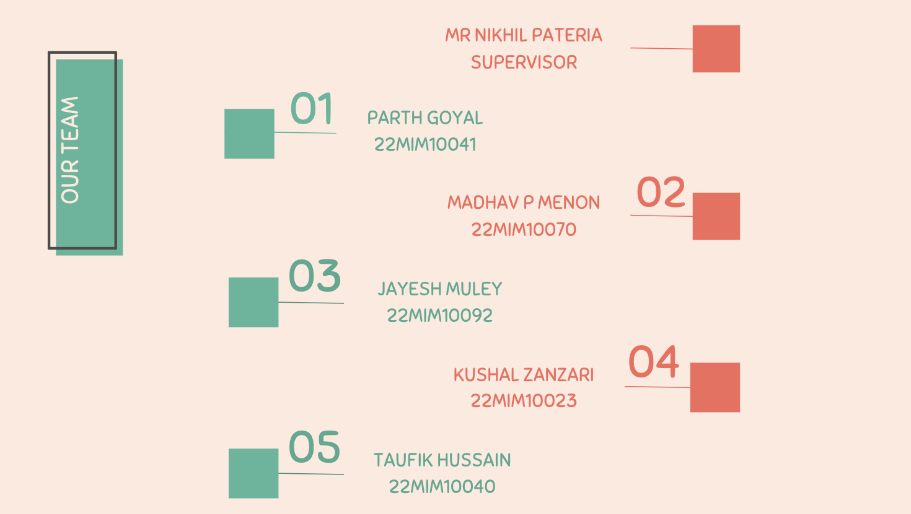

# Welcome to NutriVista 🍴🤖✨

## Where Health-Conscious Dining Meets Convenience and Flavor 🌱🍽️🔥

### 🌟 Mission
Our mission is simple yet powerful: to provide a positive and health-oriented food service that caters to the diverse needs of our users. At the heart of our platform lies an **innovative AI-powered interactive agent**, designed to understand and respond to users' queries with precision. 🤖🧠

This intelligent system enables a seamless and personalized ordering experience, considering **nutritional criteria**, **cuisine preferences**, and **dietary restrictions**. We collaborate with restaurants, bakeries, and food vendors to curate menus that blend **health-conscious options** with **delicious flavors**. 🥗🍕

Whether you're fueling your body with wholesome ingredients or indulging in a guilt-free treat, we invite you to join us on a journey toward **better eating habits**. 🚀💪

---

## 🎓 Project Exhibition
This project was proudly showcased at **VIT Bhopal** as part of our academic exhibition. Our team of **five passionate members** worked collaboratively on every aspect of the platform to make it a success. 🌟👩‍💻👨‍💻



---

## ⚡ Problem Statement
The restaurant industry faces challenges in:
- Accommodating **diverse dietary preferences and restrictions**, including **Sattvic dietary practices** and **calorie-specific needs**. 🌾📊
- Providing features on restaurant websites that cater to these specific dietary requirements. 🌐
- Enhancing user engagement due to the lack of interactive tools like **AI-driven chatbots**. 💬🤔

These gaps hinder restaurants from meeting **customer expectations**, attracting new patrons, and maintaining loyalty in a **competitive market**. 🏪💼

---

## 🎯 Objectives
1. **Comprehensive Dietary Options**: Tailored offerings for **Sattvic adherents** and individuals with **specific calorie intake needs**. 🌿🍛
2. **Exalted Dining Experience**: Prioritizing **accessibility**, **engagement**, and **convenience** to maximize online presence and foster strong customer bonds. 🤝✨
3. **AI Meal Recommendation and Customization**: Leveraging an **AI-driven Chatbot** interface for **seamless meal customization**. 🧠🍴

---

## 🌟 Key Features
- **AI-Driven Meal Customization Chatbot** 🤖🍽️: A revolutionary feature that employs advanced algorithms to:
  - Guide users through **personalized meal selections** interactively. 📋🤝
  - Allow users to specify **dietary preferences** and **desired calorie intake**. 🥗📏
  - Offer **real-time menu adjustments** tailored to user inputs. ⏱️📃
- **Enhanced User Satisfaction**: Tailoring options to individual tastes, demonstrating the restaurant's **creativity** and **customer-centric dining**. 🌟🎉
- **Seamless and Engaging Dining Experience**: A dynamic platform that stands out in providing personalized, **health-conscious meal options**. 🍱✨

---

## 💻 Technologies Used
### Frontend
- **HTML5**: Structuring and presenting content effectively. 🏗️
- **CSS3**: Ensuring a visually appealing user interface. 🎨
- **JavaScript**: For dynamic interactions and seamless user experience. ⚡
- **React.js**: Powering a responsive and interactive frontend. 💻

### Backend
- **Node.js**: Building a robust server-side environment. 🛠️
- **Express.js**: Simplifying backend routing and API management. 🔄
- **Python**: Enhancing the AI model integration with NLP capabilities. 🐍

### AI/ML
- **Natural Language Processing (NLP)**: Enabling precise understanding of user queries and context. 🗣️📚
- **Machine Learning**: Personalizing meal recommendations based on user preferences and history. 🤖🔍

### Database
- **MongoDB**: Storing user data and restaurant menu options efficiently. 📂🗄️

### Deployment
- **Docker**: Containerizing the application for seamless deployment. 📦🐳
- **AWS/Heroku**: Hosting the platform to ensure scalability and availability. 🌐☁️

---

## 🚀 Installation
1. Clone the repository:
   ```bash
   git clone https://github.com/jayesh3103/NutriVista.git
   ```
2. Navigate to the project directory:
   ```bash
   cd NutriVista
   ```
3. Install dependencies:
   ```bash
   npm install
   ```
4. Run the application:
   ```bash
   npm start
   ```
5. Access the platform locally at:
   ```
   http://localhost:3000
   ```

---

## 🎥 Demo Videos
1. **Overview of the Platform**:
   [🌟 Watch Platform Overview](./assets/Video.mp4)

2. **AI Chatbot in Action**:
   [🤖 Watch Chatbot Demo](./assets/Video1.mp4)

---

## 🤝 Contributing
We welcome contributions from the community! Please fork the repository and submit a pull request with enhancements or fixes. ✨👩‍💻👨‍💻

---

## 📜 License
This project is licensed under the MIT License. See the LICENSE file for more details. 📝

---

## 📧 Contact
For questions, feedback, or suggestions, please reach out at [jayesh.muley@yahoo.com](mailto:jayesh.muley@yahoo.com). 💌

---

Together, let’s revolutionize the dining experience with health, convenience, and flavor! 🌟🍴💚
